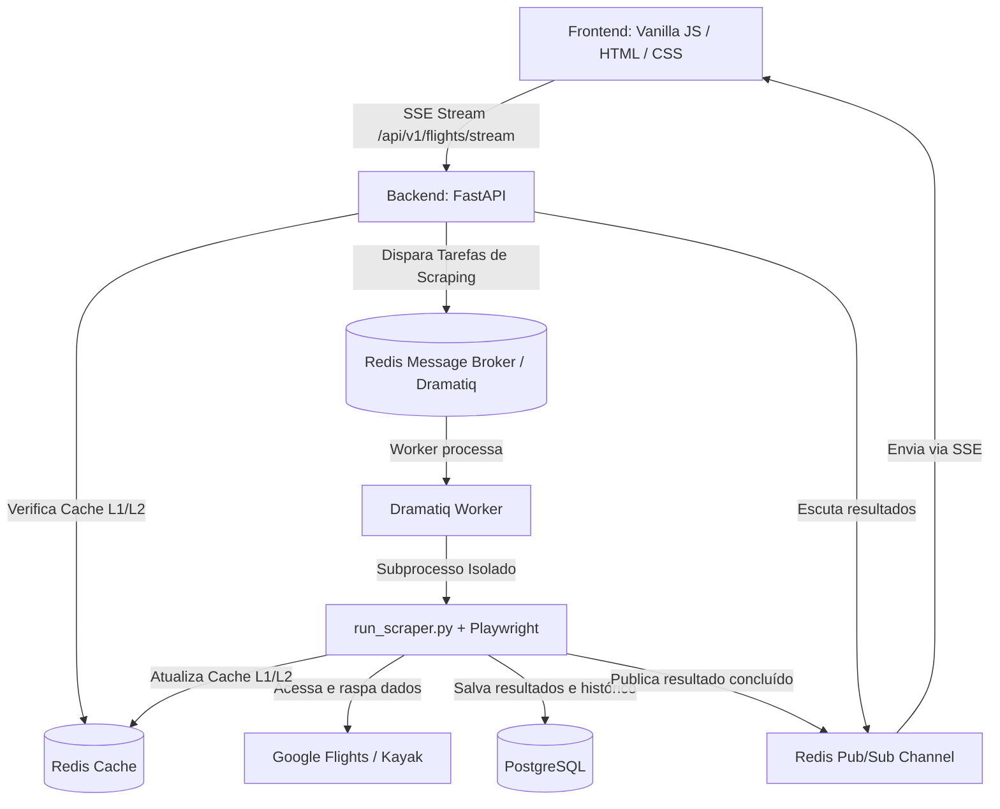

# ✈️ Análise de Funcionalidade: Partiu Viajar

O projeto **Partiu Viajar** é um metabuscador de passagens aéreas premium de alta performance, construído com uma arquitetura assíncrona baseada em eventos (EDA), cache em múltiplas camadas com proteção contra stampede, e processamento distribuído via workers em segundo plano.

Este documento apresenta uma análise detalhada da arquitetura técnica, dos fluxos de dados principais e das regras de negócio do sistema.

---

## 🏗️ Visão Geral da Arquitetura do Sistema

O sistema é modular, seguindo princípios de **Domain-Driven Design (DDD)** e **CQRS** (Command Query Responsibility Segregation) no backend, com um frontend reativo implementado em Vanilla JS, HTML5 e CSS customizado (Glassmorphism e Dark Mode).

---

## 🔄 Fluxos de Funcionalidade Principais

### 1. Busca e Streaming de Voos em Tempo Real (SSE)
A grande vantagem do sistema é a busca reativa assíncrona que não faz o usuário esperar todos os resultados terminarem para exibir os primeiros na tela.

* **Início no Frontend (`app.js`):** Quando o usuário realiza uma busca, o frontend abre uma conexão de streaming utilizando Server-Sent Events (SSE) através do endpoint `/api/v1/flights/stream`.
* **Despacho no Backend (`search_service.py`):**
  1. O backend consulta o Redis para cada coletor cadastrado (ex: `GoogleFlights`, `Kayak`).
  2. **Cache Hit:** Se os resultados estiverem salvos no cache para aquele coletor, eles são imediatamente transmitidos (`yield`) de volta para o cliente no formato SSE (`data: {...}`).
  3. **Cache Miss:** Para cada coletor que não está em cache, uma tarefa em segundo plano é enviada para a fila do Redis (`scrape_and_cache_flights_task`) via Dramatiq.
* **Escuta via Redis Pub/Sub:** O backend assina um canal de Pub/Sub do Redis para a rota de busca atual (`pubsub:flights:{origin}:{destination}:{departure_date}:{strategy}`) e aguarda pelas mensagens de conclusão dos workers.
* **Processamento no Worker (`tasks.py` & `run_scraper.py`):**
  - O worker do Dramatiq executa a tarefa. Para contornar problemas de compatibilidade do Playwright com loops de eventos assíncronos em threads secundárias do Windows, o worker inicia um processo independente (`run_scraper.py`).
  - O scraper inicia o **Playwright (Chromium Headless)**, acessa a URL configurada no coletor (ex: Google Flights ou Kayak), realiza o scrape dos dados da página (como preços, companhias aéreas e horários) e os converte em entidades de domínio.
  - O script persiste esses resultados no banco de dados **PostgreSQL** (com um *merge/upsert* para atualizar registros existentes) e insere uma entrada na tabela de histórico de preços (`flight_price_history`).
  - Salva a lista serializada no cache do Redis.
  - Publica um evento de sucesso contendo os voos no canal de Pub/Sub correspondente.
* **Exibição reativa no Frontend:** Conforme o backend recebe os eventos de Pub/Sub das tarefas que finalizaram, ele os redireciona via streaming para o frontend. O frontend manipula o DOM dinamicamente adicionando os novos cartões de voo à tela, sem necessidade de recarregar a página.

---

## 💎 Recursos de Destaque (Premium)

### 2. Combo Inteligente (Ida e Volta)
* Quando o usuário pesquisa por voos de ida e volta, o frontend separa os resultados em dois grupos com base no atributo `tripType` (`IDA` ou `VOLTA`).
* O algoritmo no frontend (`calculateSmartCombo()`) identifica automaticamente a passagem de ida mais barata e a passagem de volta mais barata.
* Ele consolida e exibe em destaque um card premium recomendado com a soma total do combo e a opção de selecionar a melhor combinação diretamente.

### 3. Autocomplete Inteligente (Typeahead)
* O dropdown personalizado utiliza um design com efeito *glassmorphic*.
* Conectado ao endpoint `/api/v1/flights/airports/search`, ele faz requisições conforme o usuário digita (com debounce de 150ms para evitar sobrecarga).
* O `AirportService` usa um algoritmo de pontuação para ordenar e priorizar os resultados:
  1. Correspondência exata do código IATA (Ex: `FOR`) recebe prioridade máxima (Score 100).
  2. Prefixo do código IATA (Score 80).
  3. Prefixo do nome da cidade (Score 60).
  4. Presença do termo de busca no nome do aeroporto ou país (Score 20).
* Possui suporte a navegação por teclado utilizando as teclas `Seta para Baixo`, `Seta para Cima`, `Enter` (para confirmar a seleção) e `Escape` (para fechar).

### 4. Histórico de Preços Interativo (Chart.js)
* Cada card de voo exibe um botão "📈 Histórico". Ao ser clicado, um modal interativo é aberto.
* O frontend carrega dinamicamente a biblioteca Chart.js via CDN apenas no primeiro clique, otimizando o carregamento inicial da página.
* Faz uma requisição ao endpoint `/api/v1/flights/price-history` fornecendo o ID do voo.
* **Garantia de Visualização (Mock Fallback):** Caso o voo tenha acabado de ser descoberto (apenas 0 ou 1 registro na tabela `flight_price_history`), o backend gera uma lista fictícia de histórico contendo variações realistas (entre -12% e +8%) dos últimos 5 dias com base no preço atual. Isso assegura que o gráfico de linha seja desenhado com gradientes e animações premium para encantar o usuário.

### 5. Alertas de Preço e Agendamento (APScheduler)
* Permite ao usuário cadastrar alertas informando seu e-mail, ID do chat no Telegram (opcional), origem, destino, data de voo e o preço máximo alvo desejado.
* Um agendador periódico executando em background (`APScheduler`) verifica a cada 10 minutos (configuração de PoC) no banco de dados se há novos voos correspondentes com preço igual ou menor que o valor alvo.
* Se a condição for atingida, o alerta é disparado (no log do sistema, simulando envio de e-mails/notificações de Telegram).

---

## 🛡️ Camadas de Proteção e Resiliência

* **Proteção contra Cache Stampede (Dogpiling):** No `SearchService`, o acesso concorrente a uma busca que causou cache miss é protegido por um Lock Distribuído no Redis com timeout (`cache_service.lock`). Se múltiplas requisições chegarem ao mesmo tempo para a mesma rota sem cache, apenas a primeira obtém o lock para disparar os raspadores. As outras aguardam em loop de *polling* curto até que o cache seja preenchido pela primeira tarefa, evitando sobrecarga sobre os coletores.
* **Taxas de Limite (Rate Limiting):** A API utiliza o middleware `slowapi` (`core/security.py`) limitando endpoints cruciais como busca e streaming a **5 requisições por minuto** por usuário/IP, prevenindo abusos.
* **Isolamento de Falhas (Anti-Corruption Layer - ACL):** Os coletores convertem diferentes estruturas de resposta (como as respostas eur/usd/brl de APIs parceiras) para a entidade de domínio `Flight` através de adaptadores específicos (ex: `CopaAdapter`, `TapAdapter`). O `currency_service` é utilizado para converter dinamicamente moedas estrangeiras para BRL.
* **Recuperação de Erros nos Scrapers:** Cada tarefa de scraping e cache possui um mecanismo de tentativas (`max_retries=2` ou `max_retries=3`) gerenciado pelo Dramatiq. Se um scraping falhar devido ao bloqueio ou lentidão de rede, a tarefa é colocada na fila para reexecução automática.

---

## 🔐 Atualizações Recentes e Autenticação (23 de Junho de 2026, 17:15)

Hoje a arquitetura do projeto foi significativamente expandida para suportar Autenticação e Hospedagem em Produção:

### 6. Sistema de Contas e OAuth2 (Google e Facebook)
* **Login Social Seguro:** O sistema agora possui integração total com Google Cloud e Facebook Developers para login via OAuth2, dispensando a necessidade de gerenciamento de senhas locais.
* **Tokens JWT Assinados:** Após a verificação com as redes sociais, o backend gera um `JSON Web Token` (JWT) válido por 7 dias, contendo nome, e-mail e avatar do usuário.
* **Persistência no PostgreSQL:** Todos os usuários são automaticamente cadastrados ou logados através do `UserModel`, criando uma base de dados unificada para o Partiu Viajar.

### 7. Proteção de Rotas e UI Dinâmica (Visitante vs Usuário)
* **Conteúdo Premium Fechado:** Módulos como Histórico de Buscas, Destinos Salvos e Alertas de Preço foram bloqueados para não-autenticados. 
* **Call To Action (CTA):** Visitantes têm acesso ao buscador principal e às rotinas gratuitas, mas são convidados por uma interface atrativa a desbloquear os limites ilimitados da plataforma fazendo um cadastro rápido e gratuito.

### 8. Deploy em Produção
* **Docker Compose de Produção:** O projeto foi adaptado para ser facilmente implantado em um servidor VPS limpo.
* **Rotas Dinâmicas de Redirecionamento:** O backend passou a ler a variável `SITE_URL` para montar os retornos de OAuth (Callback URIs), o que permite o sistema rodar nativamente em domínios oficiais (ex: `https://www.partviajar.com.br`).
* **Inicialização Inteligente:** As tabelas do banco de dados (como `users`) agora são detectadas e criadas (`create_all()`) automaticamente no momento que a API principal inicializa em um novo servidor.
